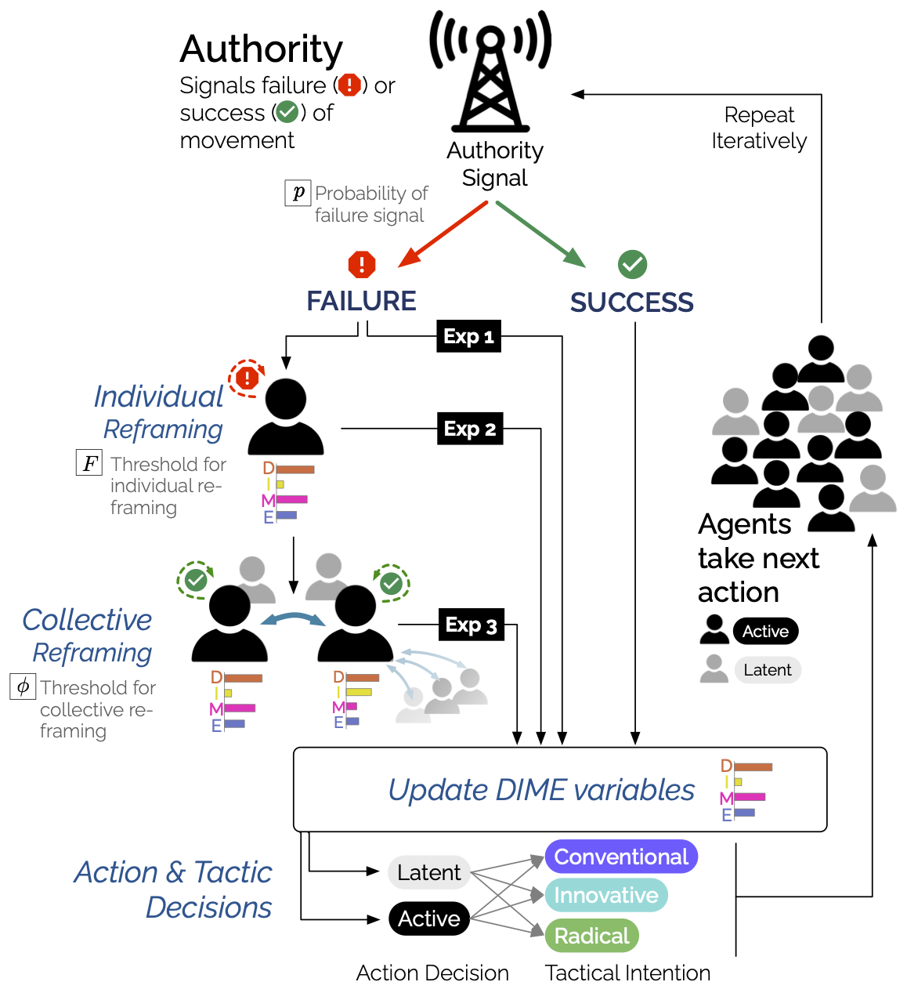

# DIMESim - an agent-based model of mobilisation and radicalisation of social movements

This repository contains the code for **DIMESim**, a theoretically-
founded and empirically-informed agent-based model of mobilisation and radicalisation of social movements introduced and analysed in the paper:

📓 _Latent Radicalism Emerges from the Repeated and Incontrovertible Failure of Collective Action_ (under review)

This repository includes all code necessary to run the model and replicate the figures in the paper. Figure numbers referred to below correspond to figure numbers in the paper under review.

Note: An earlier version of the paper was made available as a [preprint](https://arxiv.org/abs/2408.12795) on arXiv. For the version of this repository relating to that preprint, please see the version [arXiv-v2](https://github.com/specialistgeneralist/DIMESim/releases/tag/v1.0.0) of this repository.

&#x1F58B; By [Emma F. Thomas (Flinders)](https://www.flinders.edu.au/people/emma.thomas), [Mengbin Ye (Curtin)](https://mengbinye.wordpress.com/), [Simon D. Angus (Monash)](https://research.monash.edu/en/persons/simon-angus), [Tony J. Mathew (Curtin)](https://staffportal.curtin.edu.au/staff/profile/view/tony-mathew-b3201274/), [Winnifred Louis (UQ)](https://psychology.uq.edu.au/profile/2395/winnifred-louis), [Liam
Walsh (Curtin)](https://staffportal.curtin.edu.au/staff/profile/view/liam-walsh-9a92a6ad/), Silas Ellery (Filnders), [Morgana Lizzio-Wilson (Exeter)](https://psychology.exeter.ac.uk/people/profile/index.php?web_id=Morgana_Lizzio-Wilson), and [Craig McGarty (UWS)](https://scholar.google.com.au/citations?user=-UZ2Kc0AAAAJ&hl=en).



## Requirements
DIMESim has been tested on MATLAB R2021a and requires `statistics_toolbox`. However, to run experiments in parallel using `SimRunner_par2()` (see below), you will require the  Parallel Computing Toolbox (`distrib_computing_toolbox`). However, the function checks for this at run time and reverts to serial processing if the toolbox is not available.

You can check if you have the Parallel Computing Toolbox by running the following command in MATLAB:
```matlab
>> license('checkout', 'distrib_computing_toolbox')
```
A response value of `1` indicates that you have the toolbox.

## Initialisation
In Matlab, navigate to the DIMESim directory (using `cd`) and run the following command to initialise the model:
```matlab
>> setup
```
This will add the necessary paths.

To run an experiment, navigate to the `results` directory,
```matlab
>> cd results
```

## Running experiments

### A single model run
The main model function, `runModel.m` is found in the `model/` folder. To test the installation and run a single runfile (no experiments, no replicates) read the `constant_runfile.txt` and run it with `runModel.m` as follows:
```matlab
>> IN = read_constant_runfile('constant_runfile.txt');
>> res = runModel(IN);
```
this should not take more than 1s. The output `res` is a structure variable containing the model output. If you made no changes to the `constant_runfile.txt`, then you will have run the model with n=100 agents (rows) and 1000 timesteps (cols):
```matlab
>> res
res = 
  struct with fields:

                U: [1x1001 single]   .. Global broadcast signal (1=failure, -1=success)
       B_after_IR: [100x1001 single] .. Signal after individual reframing (1=failure, -1=success)
       B_after_CR: [100x1001 single] .. Signal after collective reframing (1=failure, -1=success)
                D: [100x1001 single] .. Disidentification values (in [0,100])
                I: [100x1001 single] .. Innovation values (in [0,100])
                M: [100x1001 single] .. Moralisation values (in [0,100])
                E: [100x1001 single] .. Energisation values (in [0,100])
                A: [100x1001 single] .. Action intention values (1=active, 0=inactive)
                C: [100x1001 single] .. Tactical orientation values (-1=radical, 1=conventional)
               xh: [100x1001 single] .. Last active action (-1=radical, 1=conventional)
                x: [100x1001 single] .. Current action (-1=radical, 1=conventional, 0=inactive)
           t_stop: 1000
stopping_cond_met: 0
        adjMatrix: [100x100 double]
```
To plot, for example, the time-series of average agent actions, you could run:
```matlab
>> plot(mean(res.x))
```


### Replication experiments 

To run factorial experiments across parameters as shown in the paper, we use the `SimRunner_par2()` function as a wrapper around `runModel.m`.

To generate the figures in the paper, navigate to the `results` directory and run one of the following commands as follows (qualitative runtimes are noted). Note that if you have not already set up a parallel pool, and you have the Parallel Computing Toolbox, a parallel pool will be created automatically as part of the run:
* EXP 1
  * Fig. 2 (left panel): `SimRunner_par2('exp1_general_broadcast_p0p2.txt')` (quick)
  * Fig. 2 (right panel): `SimRunner_par2('exp1_general_broadcast_p0p8.txt')` (quick)
  * Fig 3: `SimRunner_par2('exp1_general_broadcast_p-sweep.txt')` (medium)
* EXP 2
  * Fig. 4: (left panel): `SimRunner_par2('exp2_indiv_reinterp_p0p8_F0p8.txt')` (short)
  * Fig. 4: (right panel): `SimRunner_par2('exp2_indiv_reinterp_p0p8_F0p2.txt')` (short)
  * Fig. 5: `SimRunner_par2('exp2_indiv_reinterp_pF-sweep.txt')` (medium)
* EXP 3
  * Fig 6: Main results (n = 100) (main portion of figure):
    * (left panel) `SimRunner_par2('exp3_collective_reinterp_p0p8_F0p8_nu0p8.txt')` (long)
    * (right panel) `SimRunner_par2('exp3_collective_reinterp_p0p8_F0p8_nu0p2.txt')` (long)
  * Fig 6: Small n network results (n = 50) (top of figure):
    * (left panel) `SimRunner_par2('exp3_collective_reinterp_p0p8_F0p8_nu0p8_n50.txt')` (long)
    * (right panel) `SimRunner_par2('exp3_collective_reinterp_p0p8_F0p8_nu0p2_n50.txt')` (long)
  * Fig 7: `SimRunner_par2('exp3_collective-reinterp_pPhi-sweep.txt')` (very long)

Note that, in the 'sweep' experiments, where we are interested only in the population fractions of given types and strategies at the end of the experiment, we set the storage parameters in the file accordingly, leading to much smaller file sizes. For ease of replication, we include the three parameter sweep `.mat' results files in the repo.

Each of these experiments will produce a results file of the same filename, replacing `.txt` with `.mat`. To generate the plots in the paper:
* For time-series plots (Figs. 2, 4, 6), run `res_timeseries_plot(<filename.mat>)`.
* For end of experiment population fraction plots:
  * Fig. 3, run `plot_dime_actions_end_of_exp('exp1_general_broadcast_p-sweep.mat')`
  * Fig. 5, run `res_contourf('exp2_indiv_reinterp_pF-sweep.mat',[],[],'paper_figure', 3)`
  * Fig. 7, run `res_contourf('exp3_collective-reinterp_pPhi-sweep.mat',[],[],'paper_figure', 2)`


## Acknowledgements
We make use of the following packages to run and analyse our model:
* **Distinguishable Colors**: Simple colour generator for maximum perceptual distinction.
  - Author: Timothy E. Holy (Washington) ([@timholy](https://github.com/timholy))
  - Ref: https://au.mathworks.com/matlabcentral/fileexchange/29702-generate-maximally-perceptually-distinct-colors
* **Hatchfill**: Fills an area with hatching or speckling.
    - Author: Takeshi Ikuma (LSU) ([@hokiedsp](https://github.com/hokiedsp))
    - Ref: https://github.com/hokiedsp/matlab-hatchfill2/
* **Matlab Axis Label Alignment tools**: Align axis labels with axes in 3d plots.
    - Author: Ligong Han (Rutgers) ([@phymhan](https://github.com/phymhan))
    - Ref: https://github.com/phymhan/matlab-axis-label-alignment
* **SimRunner**: Scientific full-factorial experiment wrapper for numerical simulation.
  - Author: Simon D. Angus (Monash) ([@specialistgeneralist](https://github.com/specialistgeneralist))
  - Ref: https://github.com/specialistgeneralist/SimRunner


## Cite
Citation information for the model and associated paper will be available after review. In the meantime, please cite the pre-print, [available](https://arxiv.org/abs/2408.12795) at arxiv.
```
@misc{thomas2024dimesim,
      title={From Mobilisation to Radicalisation: Probing the Persistence and Radicalisation of Social Movements Using an Agent-Based Model}, 
      author={Emma F. Thomas and Mengbin Ye and Simon D. Angus and Tony J. Mathew and Winnifred Louis and Liam Walsh and Silas Ellery and Morgana Lizzio-Wilson and Craig McGarty},
      year={2024},
      eprint={2408.12795},
      archivePrefix={arXiv},
      primaryClass={cs.SI},
      url={https://arxiv.org/abs/2408.12795}, 
}
```
